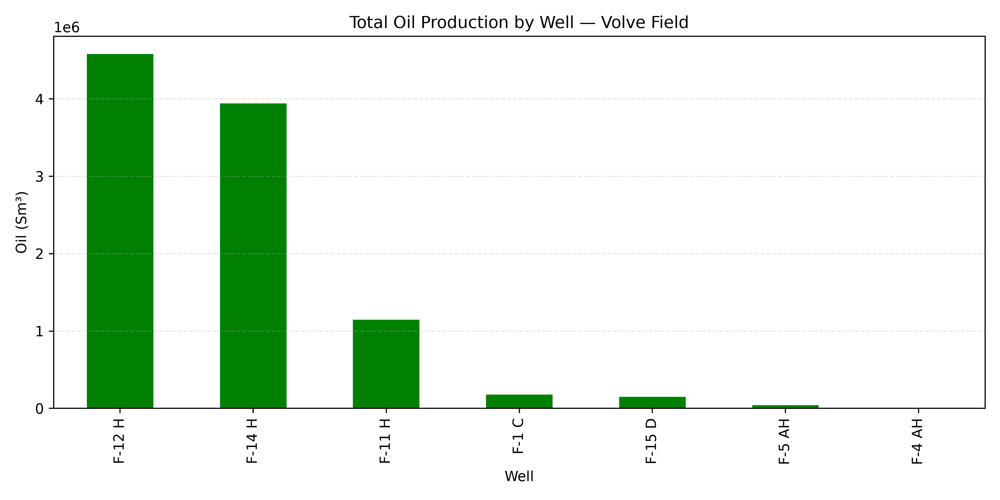
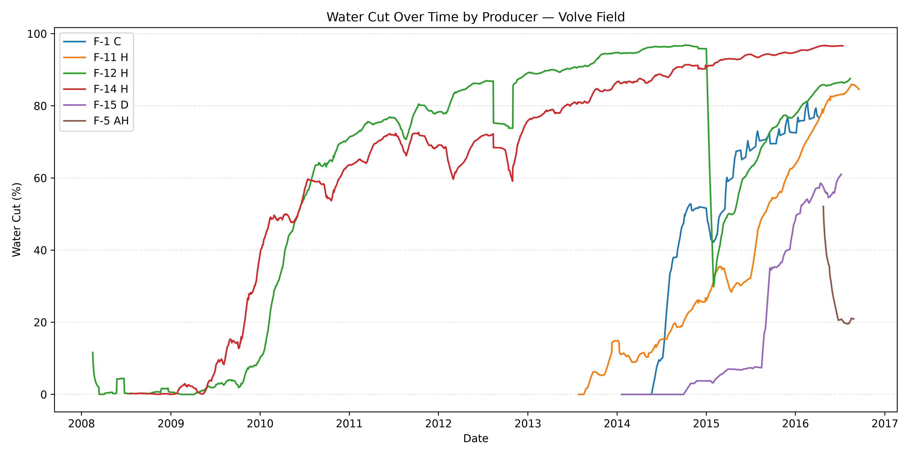

# Volve: What Killed an Oil Field?

Volve was a small oil field in the North Sea. It produced from sandstones of the Middle Jurassic **Hugin Formation** at ~2,700–3,100 m depth (Sodir Factpages). 

It started producing in 2008, was expected to last 3-5 years, and ran for 8. It shut down in 2016.

In 2018 Equinor and partners released all of its 40,000 data files to the public , every well, every day, for the whole life of the field.

This project takes that data from databricks and asks one question: **can you work out what happened to a field, and why, using only its production records?**

Turns out you can. And along the way I found something in the data that I have not seen anyone else point out.

---

## The short findings

**Volve did not run out of pressure. It drowned.**

Oil fields die in one of two ways.
1. Either the reservoir runs out of push, like a fizzy drink going flat, and the wells slowly go quiet.
2. or the wells keep flowing strong, but what comes up is mostly water not oil, until it costs more to handle the water than the oil is worth.

Volve died the second way. This is shown from 3 separate things in the data, and they all agree.

---

## What the data says

**Two wells did almost all the work.** 
F-12 H and F-14 H produced 8.5 million of the field's 10 million Sm³ (standard cubic metres of oil), which is about 63 million barrels. The other five wells put together made up the rest.

**Water arrived on schedule, and it never left.** 
Volve was kept alive by pumping water drawn from the shallow Utsira down into the rock to push the oil towards the wells. 
It works, with a catch. Eventually that water reaches the wells you were pushing the oil towards. 
By the end, the two main producers were bringing up 97% water and 3% oil.

**The reservoir kept its pressure the whole way.** 
If a field is running out of energy, pressure drops and gas starts bubbling out of the oil underground, the way a bottle of Coke fizzes when you crack the lid. That never happened here. 
Gas stayed steady for 8 years, and pressure in the best-monitored well actually went **up** by 38 bar between 2012 and shutdown.

**One well was still at full power when it drowned.** 
F-14 H had its valve wide open for the last four years of its life. No operational hold back. It was pushing as hard as it could, and it was still mostly water.
That is what a field looks like when it dies of water rather than weakness.

----

## The interesting bit I did not expect

Look at the green line above. Around early 2015 it falls off a cliff, from 97% water down to about 30%, then slowly climbs back.
Water cut does not do that. A reservoir cannot un-flood itself. So either the well changed, or the data was lying.

I went into the daily records and found this:

**The well was switched off for most of December 2014.** 32 days, no producing oil.

**When it came back on, it was a different well.**

| | Before it stopped | After it restarted |
|---|---|---|
| Oil | 184 Sm³/day | **874 Sm³/day** |
| Water cut | 96% | **30%** |
| Valve position | **100% open** | **31% open** |

That was very interesting. Before the shutdown, they had the tap wide open and the well could barely manage 184 Sm³/d of oil. 
After, with the tap two-thirds **closed**, it made almost five times (5X) more oil.

Closing a tap never makes more come out. 
The only thing that explains it is that somebody intentionally went into that well while it was switched off and changed what it was connected to underground.

Then I checked whether anything else could explain it.

**Did the reservoir change?** 
No. F-14 H, the well next door, went from 91.3% water to 91.3% water over exactly the same weeks. It did not move.

**Does switching a well off for a month just fix it?** No. 
The same well had been switched off for longer **44 days in 2012**, and came back at 85.5% water, having left at 86.8%. Nothing changed. 
The field ran the control experiment for me.

So: a well was worked on in December 2014, and it bought about a year of extra oil before the water caught up with it again.

**What the data cannot tell me** is exactly what job they did down there. 
Several different repairs would leave this same fingerprint. Working that out would need the maintenance records, which are not in this dataset.

------

## Same story, for people who don't open notebooks

Not everyone reads Python. So the whole analysis also lives in a spreadsheet —
pivot summaries, a table that flags each well's condition at a glance, and the
findings written out in plain language.

-----

## Where I checked my own work

Half of this project was applying my knowlegde to ensure the charts were honest and sound. Examples stated below.

**Blanks that were not blanks.** 
The injection wells had "NULL" written in the oil column. That does not mean the number is missing. It means those wells do not produce oil at all. 
So they became zero, and only the genuinely missing readings stayed blank.

**A well that changed jobs.**
F-5 AH spent most of its life pumping water in, then switched to pumping oil out in April 2016. 
If I had labelled it either producer or injector once and for all, every chart after that date would have been quietly wrong.

**A dead sensor pretending to be alive.** 
F-12 H's pressure gauge reported exactly 0 bar from late 2010 onwards. 
At 3 km underground, the weight of the fluid alone would read hundreds of bar. 
Zero is impossible. The gauge was dead, and I stopped its line there rather than plotting a fake collapse.

**A wrong number in my own chart.**
Oil rate = oil produced divided by hours flowed. 
On a day a well ran for 3 hours, that maths turns a small trickle into an impossible flow.
One row worked out to 24,306 Sm³/day. It put a bump in my chart that never happened. I found it, and now every rate uses full days only.

**Four rows where water came out negative.** 
Which cannot happen. One of them, left in, would have shifted a month's average by 25 points.

------

## What I would do next
This repo is a staged build. Remaining stages:

**Write it in SQL** *(in progress)*: The same sums, pulled straight from a database instead of a spreadsheet. That is how this work happens in a real company.

**Check the water balance** (VRR):  I have shown that pressure held. The next step is to check whether the amount of water pumped in actually matched the amount of oil taken out. 
That needs some lab data this file does not have, so it would be an estimate.

**Build a dashboard in Power BI**, for people who want the answer without opening a notebook.

---

## What is in the repo

| Folder | What it is |
|---|---|
| `notebooks/01` | Cleaning the raw data and building the measurements |
| `notebooks/02` | Six charts telling the story of the field |
| `notebooks/03` | Why the pressure held |
| `notebooks/04` | Finding the well that got fixed |
| `excel/` | The same analysis as a dashboard, for a non-technical audience |
| `data/` `images/` | The raw file, the cleaned file, the charts |

Built with Python and Excel.

## What is analysed
**Production performance** 
1. Total oil production by well
2. Total gas production by well
3. Oil production decline rate
4. Gas production trends

**Reservoir and well behaviour**
1. Water cut over time
2. Gas-Oil Ratio (GOR)
3. Downhole pressure trends
4. Pressure comparison between producers

**Operations**
1. Choke size versus downhole pressure
2. 32-day shut-in analysis for well F-12H
3. Production behaviour before and after restart

---
## Why Volve?

Volve dataset comprises approximately 40,000 files from the Volve field, which was in production from 2008 to 2016 (Equinor volve-data-sharing page).

The dataset is used for 4 main reasons: 
1. **It is real**: Real allocated production data, with real problems: NULL text in numeric columns, wells that changed role mid-life, missing sensor readings. This means cleaning it requires applying my professional skills.
2.**It is verifiable**: Volve's field history is publicly documented.
Adding up the daily production myself gives **10,037,081 Sm³** of oil. The Norwegian Offshore Directorate's total, summed across all wellbores, is **10,069,554 Sm³** .
A difference of **0.32%**. Every cleaning decision I made had to be right for that to happen. ([Sodir Factpages](https://factpages.sodir.no/en/field/PageView/All/3420717))
3. **It is a known field**: NCS operators know this field. Meaning the analysis can be judged on its merits by people who know the right answers.
4. **It's good for going beyond**: As a geoscientist, I wanted to apply my knowlege beyond creating charts and demonstrate how production data can be explored to understand well performance, identify production trends, and support operational decision-making.
To reflect the type of analysis done by multidisciplinary teams working across subsurface, production and data analytics.

------

## Huge credit -  Data licence & attribution

Equinor's Volve open dataset, licensed CC BY-NC-SA 4.0. 
Data belongs to © Equinor, ExxonMobil E&P Norway, Bayerngas Norge, and the Norwegian Offshore Directorate (Sodir).
Downloaded from Databricks and Used here to learn ONLY.

---

## Tools
•	Python
•	Pandas
•	NumPy
•	Matplotlib
•	Jupyter Notebook
•	Excel
•	SQL (ongoing)
•	Power BI (ongoing)

------

**Contributions and comments are welcome**

**Linda Afrifa** · MSc Petroleum Geosciences, NTNU · [LinkedIn](https://www.linkedin.com/in/linda-afrifa)

